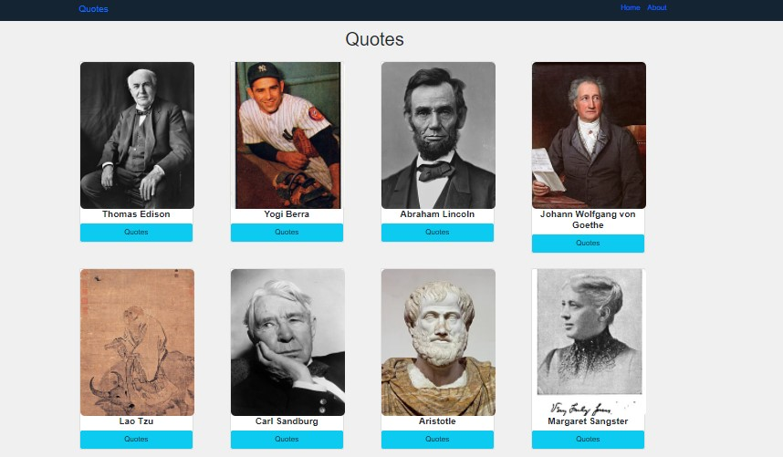

# Quotes App

Quotes app is a full-stack web application with Vue.js and Flaks.

Whether you're going through hard times, need an extra push to get stuff done, or like sharing inspirational quotes in social media, Motivation has you covered.


## Project setup
```
npm install

- Clone the git repository `git clone https://github.com/mahmoudessam820/quotes-app.git`

- Compiles and hot-reloads for development

npm run serve

- Compiles and minifies for production

npm run build

```

## What you’ll learn

### Frontend

- Begin with VUE JS version 3
- Learn some of the basic VUE tools.
- How to use Vue JS router.
- How to create views pages and use them.
- How to create Vue JS components and use them.
- How to use Bootstrap with Vue JS.

### Backend

- Begin with Flask python framework.
- How to use the BeautifulSoup library to parse the Wikipedia pages and extract the authors images class name.
- How to get quotes data from the URL: `https://type.fit/api/quotes`
and format it as JSON format.
- How to extract the authors names and use them to extract authors images from Wikioedia pages.
- How to stor all data in files useing json.dump() method.
- How to create simple API useing Flaks framework.

## Screenshots

### Home page 




### Author Quotes page 


